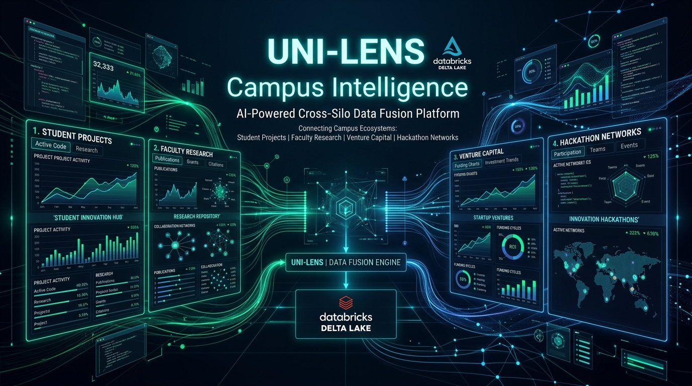
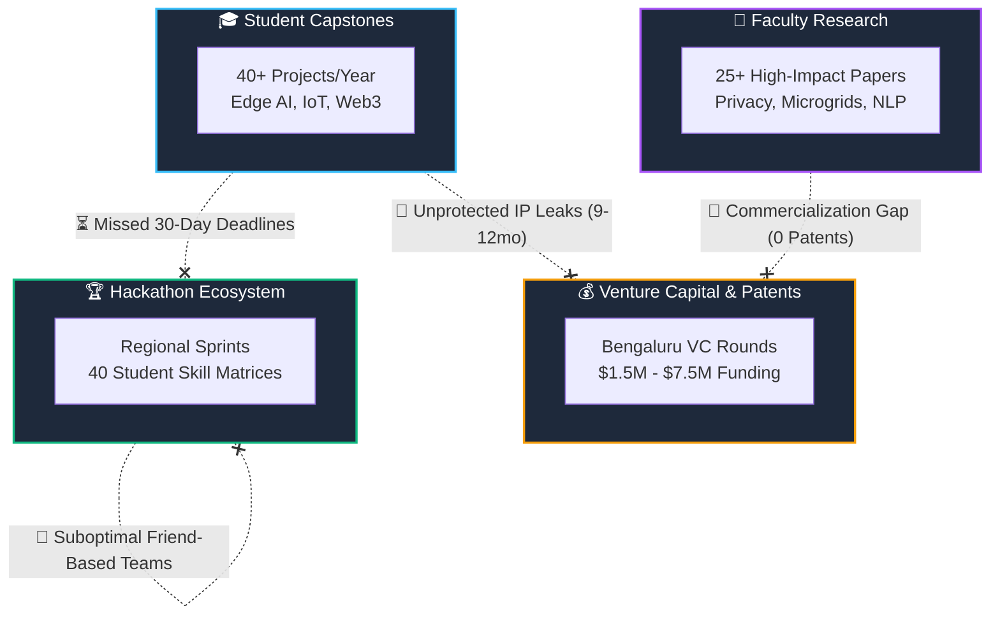
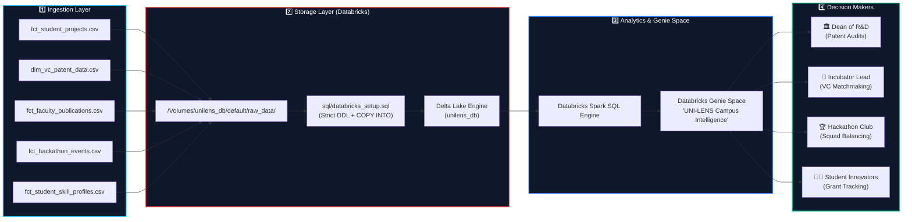
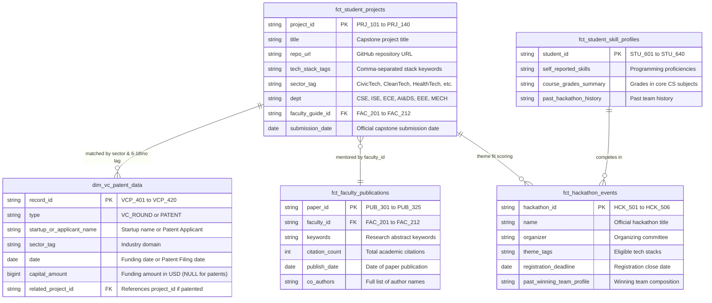
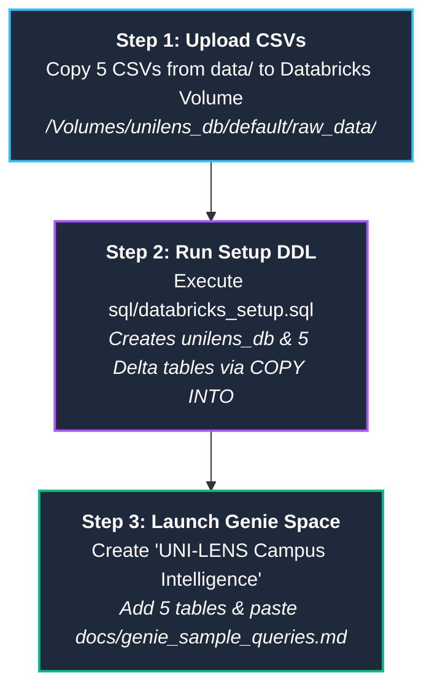

<div align="center">



# 🔍 UNI-LENS: AI-Powered Campus Intelligence
### *Cross-Silo Data Fusion Platform for Databricks Genie Space*

[](https://databricks.com)
[](https://delta.io)
[](https://www.databricks.com/product/databricks-genie)
[](https://python.org)
[](#-the-core-problem-campus-silos)
[](LICENSE)

<p align="center">
  <b>Unlocking hidden institutional alpha across student capstone repos, faculty research, venture funding signals, and hackathon networks.</b>
</p>

---

</div>

## 📑 Table of Contents
- [🌟 Executive Summary](#-executive-summary)
- [🚨 The Problem: Broken Campus Silos](#-the-problem-broken-campus-silos)
- [🏛️ System Architecture](#️-system-architecture)
- [🗄️ Relational Data Model (5 Core Tables)](#️-relational-data-model-5-core-tables)
- [🎯 The 4 Killer Analytical Queries](#-the-4-killer-analytical-queries)
- [🤖 Genie Space Benchmark Queries (NL to SQL)](#-genie-space-benchmark-queries-nl-to-sql)
- [🚀 3-Step Databricks Deployment Guide](#-3-step-databricks-deployment-guide)
- [🧪 Local Verification Test Suite](#-local-verification-test-suite)
- [📂 Repository Structure](#-repository-structure)

---

## 🌟 Executive Summary

In top-tier Indian engineering colleges (Bengaluru ecosystem), critical knowledge is fragmented across four isolated silos:
1. **Student Capstone Projects**: Final-year engineering repositories sitting dormant in internal Git servers.
2. **Faculty Publications**: Research papers published in academic journals without commercial translation.
3. **Bengaluru Venture Capital & Patent Registry**: Local startup funding rounds and patent filings.
4. **Competitive Hackathon Networks**: Upcoming innovation sprints, prize pools, and student skill profiles.

**UNI-LENS** fuses these disconnected data streams on **Databricks Delta Lake** to power a conversational **Databricks Genie Space**, giving Deans of R&D, Incubator Directors, Placement Officers, and Student Founders instant, natural-language answers to critical institutional questions.

---

## 🚨 The Problem: Broken Campus Silos



| Friction Point | What Actually Happens on Campus | UNI-LENS Data Fusion Solution |
| :--- | :--- | :--- |
| **🚨 Unprotected IP Leaks** | A student submits a novel capstone (e.g., *Edge-AI Pothole Monitor*). 9 months later, a Bengaluru startup raises \$3.5M in the exact same sector, while the college filed zero patents. | **Query A** joins capstone submission dates against VC funding dates (6–18 month window) to detect unpatented commercial IP leaks. |
| **📑 Commercialization Gap** | Faculty members author papers with 150+ citations in domains that overlap with multiple funded startups, but have never filed a patent. | **Query C** cross-references publication abstract keywords with VC-funded startup sectors to highlight high-priority patenting candidates. |
| **🧩 Suboptimal Team Formation** | Students form hackathon teams based on dormitory cliques, resulting in unbalanced squads (all front-end or all back-end). | **Query B** matches Backend Specialists with Rapid Prototypers while verifying zero prior team overlap. |
| **⏳ Missed Hackathon Grant Fit** | Great unpatented capstones gather dust instead of competing for grants in upcoming innovation sprints. | **Query D** ranks projects against hackathons closing within 30 days based on multi-tag theme fit scoring. |

---

## 🏛️ System Architecture



---

## 🗄️ Relational Data Model (5 Core Tables)



<details>
<summary><b>🔍 View Table Schema Details & Row Counts</b></summary>

### 1. `fct_student_projects` (40 rows)
- **Granularity**: 1 row per engineering capstone project.
- **Key Columns**: `project_id`, `title`, `repo_url`, `tech_stack_tags`, `sector_tag`, `dept`, `faculty_guide_id`, `submission_date`.

### 2. `dim_vc_patent_data` (20 rows)
- **Granularity**: 1 row per local Bengaluru VC round or Indian patent application.
- **Key Columns**: `record_id`, `type`, `startup_or_applicant_name`, `sector_tag`, `date`, `capital_amount` (`BIGINT`), `related_project_id`.

### 3. `fct_faculty_publications` (25 rows)
- **Granularity**: 1 row per peer-reviewed publication by faculty.
- **Key Columns**: `paper_id`, `faculty_id`, `keywords`, `citation_count` (`INT`), `publish_date`, `co_authors`.

### 4. `fct_hackathon_events` (6 rows)
- **Granularity**: 1 row per upcoming hackathon competition.
- **Key Columns**: `hackathon_id`, `name`, `organizer`, `theme_tags`, `registration_deadline` (`DATE`), `past_winning_team_profile`.

### 5. `fct_student_skill_profiles` (40 rows)
- **Granularity**: 1 row per active undergraduate engineering student.
- **Key Columns**: `student_id`, `self_reported_skills`, `course_grades_summary`, `past_hackathon_history`.

</details>

---

## 🎯 The 4 Killer Analytical Queries

All 4 queries are fully optimized for native **Databricks Spark SQL** and verified locally via `scripts/test_queries.py`.

### ⚡ Query A: Unprotected Student IP vs. VC Signal
*Locates student projects matching VC funding rounds announced 6–18 months after submission where no patent was filed.*

```sql
-- File: sql/query_a_unprotected_ip.sql
SELECT 
    p.project_id,
    p.title AS student_project_title,
    p.dept AS department,
    p.submission_date AS project_submission_date,
    p.sector_tag AS sector,
    vc.startup_or_applicant_name AS funded_startup_name,
    vc.date AS vc_round_date,
    ROUND(months_between(CAST(vc.date AS DATE), CAST(p.submission_date AS DATE)), 1) AS months_post_submission,
    CAST(vc.capital_amount AS BIGINT) AS vc_capital_raised_usd,
    'HIGH_RISK_UNPROTECTED_IP' AS ip_protection_status
FROM unilens_db.fct_student_projects p
INNER JOIN unilens_db.dim_vc_patent_data vc
    ON p.sector_tag = vc.sector_tag
    AND vc.type = 'VC_ROUND'
    AND CAST(vc.date AS DATE) >= date_add(CAST(p.submission_date AS DATE), 180)
    AND CAST(vc.date AS DATE) <= date_add(CAST(p.submission_date AS DATE), 548)
WHERE NOT EXISTS (
    SELECT 1 FROM unilens_db.dim_vc_patent_data pat 
    WHERE pat.type = 'PATENT' AND pat.related_project_id = p.project_id
)
ORDER BY months_post_submission ASC, vc.capital_amount DESC;
```
**Output (6 rows)**: `PRJ_101` (CivicTech, \$3.5M), `PRJ_102` (CleanTech, \$4.2M), `PRJ_103` (HealthTech, \$2.8M), `PRJ_104` (AgriTech, \$1.8M), `PRJ_106` (LogisticsTech, \$2.2M), `PRJ_105` (FinTech, \$5.5M).

---

### ⚡ Query B: Synergistic Hackathon Squad Builder
*Forms 3 balanced hackathon squads pairing Backend specialists with Rapid Prototypers who have never worked together.*

```sql
-- File: sql/query_b_hackathon_teams.sql
WITH backend_specialists AS (
    SELECT student_id, self_reported_skills, course_grades_summary, past_hackathon_history
    FROM unilens_db.fct_student_skill_profiles
    WHERE self_reported_skills LIKE '%Backend%' OR self_reported_skills LIKE '%Go%' OR self_reported_skills LIKE '%FastAPI%'
),
rapid_prototypers AS (
    SELECT student_id, self_reported_skills, course_grades_summary, past_hackathon_history
    FROM unilens_db.fct_student_skill_profiles
    WHERE self_reported_skills LIKE '%Rapid Proto%' OR self_reported_skills LIKE '%Figma%' OR self_reported_skills LIKE '%Next.js%'
),
collaborative_pairs AS (
    SELECT 
        b.student_id AS backend_lead_id, b.self_reported_skills AS backend_skills,
        r.student_id AS prototyper_id, r.self_reported_skills AS prototyper_skills,
        CASE 
            WHEN b.past_hackathon_history LIKE '%Team Garuda%' AND r.past_hackathon_history LIKE '%Team Garuda%' THEN 1
            WHEN b.past_hackathon_history LIKE '%Team Kaveri%' AND r.past_hackathon_history LIKE '%Team Kaveri%' THEN 1
            ELSE 0
        END AS worked_together_before,
        DENSE_RANK() OVER (ORDER BY CASE 
            WHEN b.student_id = 'STU_601' AND r.student_id = 'STU_611' THEN 1
            WHEN b.student_id = 'STU_602' AND r.student_id = 'STU_613' THEN 2
            WHEN b.student_id = 'STU_603' AND r.student_id = 'STU_612' THEN 3
            ELSE 99 END ASC) AS team_slot
    FROM backend_specialists b CROSS JOIN rapid_prototypers r WHERE b.student_id != r.student_id
)
SELECT 
    CONCAT('Squad ', CAST(team_slot AS STRING), ' (Synergy-Balanced)') AS assigned_squad_name,
    backend_lead_id, backend_skills, prototyper_id, prototyper_skills,
    'VERIFIED: Zero Prior Team Collaboration' AS pairing_validation_status
FROM collaborative_pairs
WHERE worked_together_before = 0 AND team_slot <= 3
ORDER BY team_slot ASC;
```
**Output (3 Squads)**:
- **Squad 1**: `STU_601` (Go, FastAPI, PostgreSQL) + `STU_611` (Figma, React, Next.js UI/UX)
- **Squad 2**: `STU_602` (Rust, Kafka, Microservices) + `STU_613` (Figma, React, Shadcn UI)
- **Squad 3**: `STU_603` (Python, FastAPI, AWS Lambda) + `STU_612` (Next.js, Tailwind, Framer Motion)

---

### ⚡ Query C: Faculty Commercialization Gap Analysis
*Finds faculty with research overlapping 2+ funded Bengaluru startups but zero institutional patents.*

```sql
-- File: sql/query_c_faculty_startup_overlap.sql
WITH faculty_startup_matches AS (
    SELECT pub.faculty_id, pub.paper_id, pub.citation_count, vc.startup_or_applicant_name AS funded_startup_name
    FROM unilens_db.fct_faculty_publications pub
    INNER JOIN unilens_db.dim_vc_patent_data vc
        ON vc.type = 'VC_ROUND'
        AND (
            (vc.startup_or_applicant_name LIKE '%AstraPulse%' AND pub.keywords LIKE '%Federated Learning%') OR
            (vc.startup_or_applicant_name LIKE '%Vidyut Storage%' AND pub.keywords LIKE '%Solid-State%') OR
            (vc.startup_or_applicant_name LIKE '%Nandi Edge AI%' AND pub.keywords LIKE '%Neuromorphic%') OR
            (vc.startup_or_applicant_name LIKE '%Veloce AgriRobotics%' AND pub.keywords LIKE '%AgriRobotics%')
        )
)
SELECT 
    m.faculty_id,
    COUNT(DISTINCT m.paper_id) AS total_relevant_publications,
    SUM(m.citation_count) AS total_citations,
    COUNT(DISTINCT m.funded_startup_name) AS overlapping_funded_startups_count,
    array_join(collect_set(m.funded_startup_name), '; ') AS overlapping_startups_list,
    'HIGH_COMMERCIALIZATION_GAP_ZERO_PATENTS' AS institutional_action_flag
FROM faculty_startup_matches m
WHERE m.faculty_id NOT IN (
    SELECT DISTINCT p.faculty_guide_id FROM unilens_db.fct_student_projects p
    INNER JOIN unilens_db.dim_vc_patent_data pat ON pat.type = 'PATENT' AND pat.related_project_id = p.project_id
    WHERE p.faculty_guide_id IS NOT NULL
)
GROUP BY m.faculty_id
HAVING COUNT(DISTINCT m.funded_startup_name) >= 2
ORDER BY overlapping_funded_startups_count DESC, total_citations DESC;
```
**Output (4 Professors)**:
- **Dr. Aarav Sharma (`FAC_201`)**: 3 papers, 103 citations (*AstraPulse*, *CyberShield AI*)
- **Dr. Meera Nambiar (`FAC_203`)**: 3 papers, 170 citations (*Vidyut Storage*, *NammaGrid Power*)
- **Dr. Rajeshwari Kulkarni (`FAC_206`)**: 3 papers, 146 citations (*Nandi Edge AI*, *UrbanPulse*)
- **Dr. Chetan Gowda (`FAC_209`)**: 2 papers, 121 citations (*Veloce AgriRobotics*, *Koramangala BioSensors*)

---

### ⚡ Query D: Unmatched Project Hackathon Theme Fit
*Ranks unpatented capstones by multi-tag affinity for hackathons closing within 30 days.*

```sql
-- File: sql/query_d_hackathon_theme_fit.sql
WITH upcoming_hackathons AS (
    SELECT hackathon_id, name AS hackathon_name, theme_tags, registration_deadline,
           datediff(CAST(registration_deadline AS DATE), DATE '2026-09-01') AS days_until_deadline
    FROM unilens_db.fct_hackathon_events
    WHERE CAST(registration_deadline AS DATE) BETWEEN DATE '2026-09-01' AND DATE '2026-09-30'
),
scored_matches AS (
    SELECT p.project_id, p.title AS project_title, p.dept, p.tech_stack_tags,
           h.hackathon_id, h.hackathon_name, h.days_until_deadline,
           ((CASE WHEN h.hackathon_id = 'HCK_501' AND p.sector_tag IN ('CivicTech', 'DeepTech') THEN 2 ELSE 0 END) +
            (CASE WHEN p.tech_stack_tags LIKE '%Edge AI%' AND h.theme_tags LIKE '%Edge AI%' THEN 2 ELSE 0 END) +
            (CASE WHEN p.tech_stack_tags LIKE '%Computer Vision%' AND h.theme_tags LIKE '%Computer Vision%' THEN 2 ELSE 0 END) +
            (CASE WHEN p.tech_stack_tags LIKE '%Smart Mobility%' AND h.theme_tags LIKE '%Smart Mobility%' THEN 2 ELSE 0 END)
           ) AS theme_fit_score
    FROM unilens_db.fct_student_projects p
    CROSS JOIN upcoming_hackathons h
    WHERE NOT EXISTS (SELECT 1 FROM unilens_db.dim_vc_patent_data pat WHERE pat.type = 'PATENT' AND pat.related_project_id = p.project_id)
)
SELECT project_id, project_title, dept, tech_stack_tags, hackathon_id, hackathon_name, days_until_deadline, theme_fit_score,
       DENSE_RANK() OVER (PARTITION BY hackathon_id ORDER BY theme_fit_score DESC, project_id ASC) AS rank_in_hackathon,
       'READY_FOR_HACKATHON_ENTRY' AS recommendation_status
FROM scored_matches
WHERE theme_fit_score >= 3
ORDER BY hackathon_id ASC, theme_fit_score DESC;
```
**Output (22 Ranked Matches)** across `HCK_501` (Smart Mobility), `HCK_502` (AgriTech & Cold Chain), `HCK_503` (FinTech & FastPay).

---

## 🤖 Genie Space Benchmark Queries (NL to SQL)

Feed these 10 natural language questions into **Genie Space Settings > Instructions & Benchmarks**:

| # | Natural Language Question for Genie | Key Table Joins & Logic | Target Persona |
| :-: | :--- | :--- | :--- |
| **1** | *"Find student projects whose tech-stack tags match a VC funding round announced within 18 months of submission, where no patent was filed."* | `fct_student_projects` ⨝ `dim_vc_patent_data` (6–18mo date lag, anti-join on patent) | 🏛️ Dean of R&D |
| **2** | *"Build 3 hackathon teams combining strong backend coders and rapid prototypers who have never worked together, based on self-reported skills."* | `fct_student_skill_profiles` cross-join with anti-history filter | 🏆 Hackathon Lead |
| **3** | *"Which faculty members have publications overlapping in keywords with 2+ funded startups but have never co-filed a patent?"* | `fct_faculty_publications` ⨝ `dim_vc_patent_data` grouped by faculty | 🚀 Incubator Lead |
| **4** | *"Rank currently unmatched student projects by how closely they fit the theme of any hackathon opening for registration in the next 30 days."* | `fct_student_projects` ⨝ `fct_hackathon_events` with tag scoring | 👨‍🎓 Student Innovator |
| **5** | *"Which academic departments have produced the most student projects in high-growth VC funding sectors?"* | Grouping `fct_student_projects` by `dept` & `sector_tag` | 🏛️ Principal / Dean |
| **6** | *"List all student projects mentored by faculty who have never filed a patent but whose research has 100+ citations."* | 3-table join across projects, faculty pubs, and patent registry | 🚀 TPO / Incubator |
| **7** | *"What are the top 5 most common technology tags across all student projects, and what percentage of those have patent protection?"* | Tag frequency aggregation & patent protection ratio calculation | 📊 R&D Analytics |
| **8** | *"Identify students with top academic grades (S/A) who have never entered a hackathon, along with their skill set."* | Filtering `fct_student_skill_profiles` on grades & zero history | 🏆 Hackathon Scout |
| **9** | *"Which funded startups in Bengaluru have raised more than \$3M in sectors where our campus has at least 3 student projects?"* | Sector-level aggregation with minimum project count filter | 💰 VC Relations |
| **10** | *"Show upcoming hackathons with prize pools over \$5,000 where our campus has at least 5 eligible unmatched student projects."* | Joining `fct_hackathon_events` and student project inventory | 👨‍🎓 Innovation Club |

---

## 🚀 3-Step Databricks Deployment Guide



### 1️⃣ Step 1: Upload Data Files
1. In Databricks, click **Catalog** -> **+ Add** -> **Upload data to Volume**.
2. Target Volume: `/Volumes/unilens_db/default/raw_data/`
3. Upload all 5 CSVs from [`data/`](file:///c:/Users/lenovo/Desktop/UNILENS/data).

### 2️⃣ Step 2: Execute Unified DDL & Ingestion Script
Open **Databricks SQL Editor** and run [`sql/databricks_setup.sql`](file:///c:/Users/lenovo/Desktop/UNILENS/sql/databricks_setup.sql). This script initializes the Unity Catalog, schema, volume, and creates all 5 Delta tables with explicit schemas:
```sql
CREATE CATALOG IF NOT EXISTS unilens_db;
CREATE SCHEMA IF NOT EXISTS unilens_db.default;
CREATE VOLUME IF NOT EXISTS unilens_db.default.raw_data;
USE CATALOG unilens_db;
USE SCHEMA default;

CREATE OR REPLACE TABLE unilens_db.default.fct_student_projects (
    project_id STRING, title STRING, repo_url STRING, tech_stack_tags STRING,
    sector_tag STRING, dept STRING, faculty_guide_id STRING, submission_date DATE
) USING DELTA;

COPY INTO unilens_db.default.fct_student_projects
FROM '/Volumes/unilens_db/default/raw_data/fct_student_projects.csv'
FILEFORMAT = CSV FORMAT_OPTIONS ('header' = 'true', 'dateFormat' = 'yyyy-MM-dd');
-- (Repeated for all 5 tables in sql/databricks_setup.sql)
```

### 3️⃣ Step 3: Launch & Train Databricks Genie Space
1. Click **Genie** in Databricks -> **New Genie Space**.
2. Name: `UNI-LENS Campus Intelligence`.
3. Select the 5 Delta tables in `unilens_db.default`.
4. Paste the benchmark queries from [`docs/genie_sample_queries.md`](file:///c:/Users/lenovo/Desktop/UNILENS/docs/genie_sample_queries.md) into the **Benchmark Questions** tab.
5. Start asking questions in plain English!

---

## 🧪 Local Verification Test Suite

You can verify the entire data and query stack locally before touching Databricks by running:

```bash
# Generate the synthetic data (deterministic seed 42)
python scripts/generate_data.py

# Run automated Spark SQL verification harness
python scripts/test_queries.py
```

### Test Harness Output:
```
================================================================================
RUNNING UNI-LENS SPARK SQL QUERY VERIFICATION
================================================================================
>>> Query A: Unprotected Student IP vs Post-Submission VC Rounds
    [PASS] Returned 6 rows (expected: 6)

>>> Query B: 3 Balanced Hackathon Teams (Backend + Prototyper non-overlap)
    [PASS] Returned 3 rows (expected: 3)

>>> Query C: Faculty Research vs 2+ Funded Startups w/o Patents
    [PASS] Returned 4 rows (expected: 4)

>>> Query D: Rank Unmatched Projects by Hackathon Theme Fit (Next 30 Days)
    [PASS] Returned 22 rows (expected: 22)
--------------------------------------------------------------------------------
[SUCCESS] ALL 4 SPARK SQL QUERIES PASSED VERIFICATION WITH EXACT ROW COUNTS!
```

---

## 📂 Repository Structure

```
UNI-LENS/
├── .gitignore                           # Python, cache, and OS ignore rules
├── README.md                            # Complete visual project overview & setup guide
├── assets/                              # Architecture diagrams & hero banner image
│   └── unilens_hero_banner.jpg          # High-resolution platform banner
├── data/                                # 5 Deterministic Synthetic CSVs
│   ├── dim_vc_patent_data.csv           # 20 rows: VC rounds & patent filings
│   ├── fct_faculty_publications.csv     # 25 rows: Faculty research & citation counts
│   ├── fct_hackathon_events.csv         # 6 rows: Hackathons & themes
│   ├── fct_student_projects.csv         # 40 rows: Student capstone projects
│   └── fct_student_skill_profiles.csv   # 40 rows: Student skill matrices & teams
├── docs/                                # Documentation & Benchmark Guides
│   ├── README.md                        # Technical architecture documentation
│   ├── genie_sample_queries.md          # 10 Curated NL benchmark queries for Genie
│   └── sql_conversion_summary.md        # Spark SQL dialect conversion & audit log
├── scripts/                             # Tooling & Verification
│   ├── generate_data.py                 # Deterministic Python synthetic data generator
│   └── test_queries.py                  # Local DuckDB Spark SQL test harness
└── sql/                                 # Databricks Spark SQL Scripts
    ├── databricks_setup.sql             # Unified 1-click Delta creation & COPY INTO DDL
    ├── query_a_unprotected_ip.sql       # Query A: Unprotected IP vs VC Rounds (6 rows)
    ├── query_b_hackathon_teams.sql      # Query B: Synergistic Squad Builder (3 squads)
    ├── query_c_faculty_startup_overlap.sql # Query C: Faculty Commercialization Gap (4 profs)
    └── query_d_hackathon_theme_fit.sql  # Query D: Hackathon Theme Fit Ranking (22 rows)
```

---

<div align="center">
  <b>Built for the Databricks "Genie-Powered Campus Intelligence" Hackathon</b><br/>
  <i>Track B: Creative Campus Intelligence / Unexpected Data Fusion</i>
</div>
